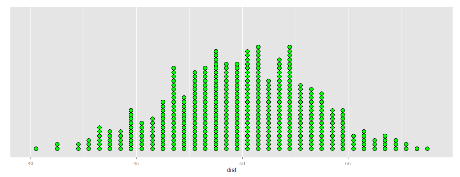

## Statistics For A General Audience(?)

* Ensuring an adequate sample size is important if findings are to be reliable
* But how do you explain to a general audience why a certain minimum sample size is important?
* You could try this, which is the statistical formula derived from the Central Lmit Theorem

###### Required Sample Size = $\frac{\frac{z^2p(1-p)}{e^2}}{1+(\frac{z^2p(1-p)}{e^2N})}$

* But you are unlikely to convince any of your audience!
* There has to be a better way to demonstrate why a particular minimum sample size is needed


--- 

## John Rauser Keynote - Strata + Hadoop 2014

* While wrestling with this problem I saw John Rauser's keynote 
* He showed how to demonstrate by simulation rather than theory a "t-test"
    + Check it out at https://www.youtube.com/watch?v=5Dnw46eC-0o
* John's approach let me to consider how I could do the same for determining minimum sample sizes...
* `...` not using theory but by creating a sampling distribution by simulation

--- 

## A Simulated Sampling Distribution

By using a sampling distribution created by taking a large number of different samples from a population we can demonstrate empirically what proportion of those samples are within a certain range, and show that the larger the sample size, the narrower variance from the mean of the sampling distribution. 

 


--- 

## The Shiny App Solution

* The Shiny App will enable us to show the theoretical sampling distribution and then show a sampling distribution created by simulation. The results will be shown in two separate tabs, enabling a comparison between the confidence intervals derived by theory and by simulation. For example, here is a confidence interval for a binomial sampling distribution where the sample size is 100 and the proportion in the population is 0.5 (50%)


```
## [1] "95% confidence interval using theory = 40.4% to 59.6% (Mean = 50%)"
```

And here is a confidence interval for a sampling distribution derived from 1000 simulated samples for the same sample size and proportion in the population


```
## [1] "95% confidence interval using simulation = 40% - 60% (Mean = 50.1%)"
```

As we can see, the confidence interval derived from the simulation without any maths, and easier to explain to a general audience,  is similar to the confidence interval derived by theory!

A third tab includes the documentation for the app (i.e. the instructions for use). 


                round(dist$dist[(k*0.025)+1],1), "% - ", round(dist$dist[(k*0.975)], 1), 
                "% (Mean = ", round(mean(dist$dist),1), "%)", sep = "")


